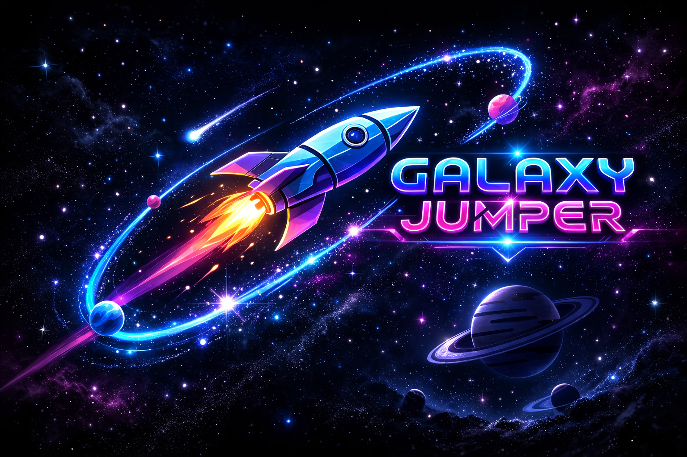

# Galaxy Jumper 

'Jump into Infinity'

---

Galaxy Jumper is a high-octane, endless space survival game built with HTML5 Canvas and JavaScript. Navigate through a dangerous asteroid field, evade the Nebula Sentinels, and survive cosmic distortions to achieve the highest score.

Set in the depths of an ever-expanding cosmos, the game challenges you to navigate through relentless waves of asteroids, satellites, and unpredictable space debris. With every second you survive, the speed intensifies and the stakes rise, transforming each run into a battle against both gravity and time. There are no levels to complete and no finish line to cross—only your skill, precision, and focus determine how far you go. 

Galaxy Jumper delivers a clean, immersive experience built purely around reaction speed and competitive high-score mastery. In this universe, hesitation means collision, and only the sharpest players dominate the stars. 🚀

“Every jump counts.”

“Outrun the cosmos.”

“Dodge. Jump. Dominate.”

🎮 How to Play:-

Movement: Use the Left (←) and Right (→) arrow buttons to switch lanes.

Jump: Tap the Up (↑) arrow to jump.

Pro-Tip: Frequent jumping allows you to navigate tighter obstacle clusters.

The Mission

Avoid red and pink energy barriers. If you hit an obstacle or a Nebula Sentinel without a shield, your mission ends.

✨ Features

🛸 Defense Drones: Automatically fires lasers at incoming obstacles.

🧲 Magnetic Field: Pulls all nearby Stardust Coins toward you.

🛡️ Energy Shield: Absorbs one hit from any hazard.

💥 Supernova: Every 500 points, clear the entire screen of threats.

Cosmic Hazards:

🌀 Nebula Clouds: Touching these will invert your controls and blur your vision.

🛰️ Sentinels: Moving enemies that patrol the lanes.

One Galaxy. Endless Runs.

Gravity Is Just a Suggestion.

Speed Is Your Only Weapon.

Audio: Procedural sound synthesis using the Web Audio API (no external .mp3 files needed!).

Procedural Generation: An anti-pattern spawn engine ensures that every run is unique and fair.

Responsiveness: Fully responsive design that adapts to mobile and desktop screens.

---
Tech Stack 

Click here to play ! [https://jashbhai635.github.io/Galaxy-Jumper/]

This game is best experienced on itch.io

---
© 2026 CodeMatrix Studio. All rights reserved.

